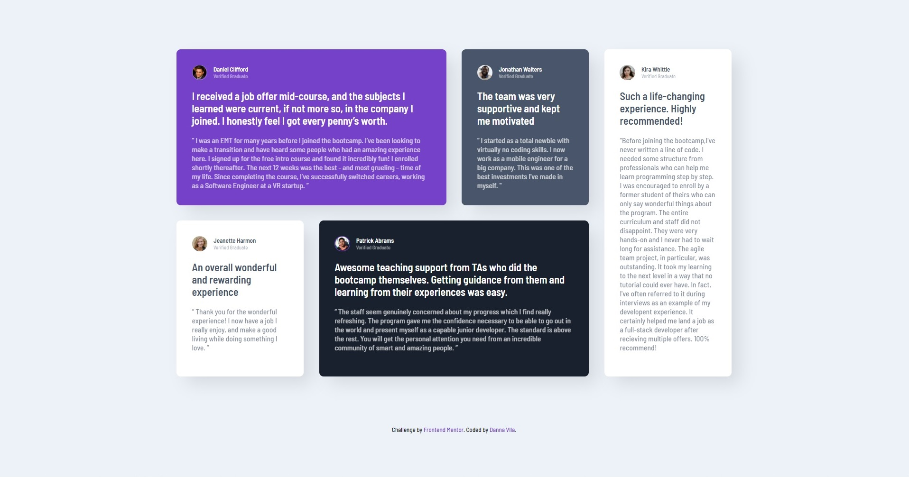

# Frontend Mentor - Testimonials grid section solution

This is a solution to the [Testimonials grid section challenge on Frontend Mentor](https://www.frontendmentor.io/challenges/testimonials-grid-section-Nnw6J7Un7). Frontend Mentor challenges help you improve your coding skills by building realistic projects. 

## Table of contents

- [Overview](#overview)
  - [The challenge](#the-challenge)
  - [Screenshot](#screenshot)
  - [Links](#links)
- [My process](#my-process)
  - [Built with](#built-with)
  - [What I learned](#what-i-learned)
  - [Continued development](#continued-development)
  - [Useful resources](#useful-resources)
- [Author](#author)

## Overview

### The challenge

Users should be able to:

- View the optimal layout for the site depending on their device's screen size

### Screenshot

### Links

- Solution URL: [Solution FrontendMentor](https://www.frontendmentor.io/solutions/responsive-page-using-css-gri-BkI2JSyB5)
- Live Site URL: [Danna-Vila-grid-challenge](https://danna-vila-grid-challenge.pages.dev/)

## My process

### Built with

- Semantic HTML5 markup
- CSS custom properties
- Flexbox
- CSS Grid
- Mobile-first workflow

### What I learned

I learned how to make a responsive web page using CSS Grid, this is my first challenge, i found this useful to practice and learn how to improve my coding skills.

### Continued development

I want to know how to improve building with CSS Grid, I am happy with the result, but I consider there are better ways to apply this technique.

### Useful resources

- [CSS Tricks - Guide GRID](https://css-tricks.com/snippets/css/complete-guide-grid/) - This helped me for a better understanding of CSS Grid, such a great article.

## Author

[Danna Vila]
- Frontend Mentor - [@dannxvc](https://www.frontendmentor.io/profile/dannxvc)
- Portfolio - [@dannxvc](https://danna.pages.dev/)
